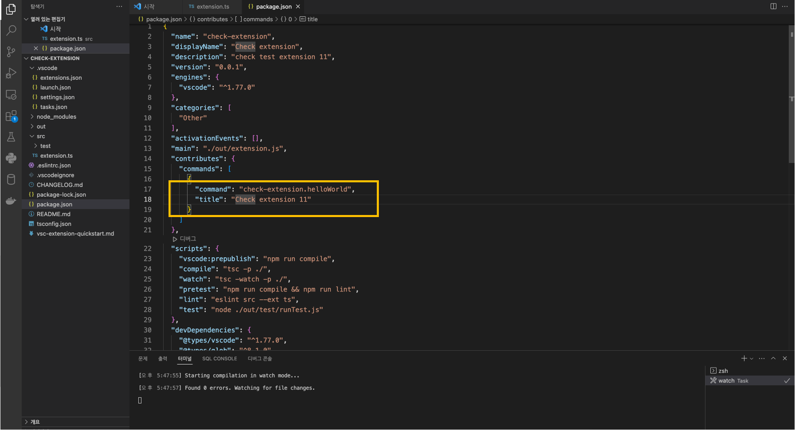
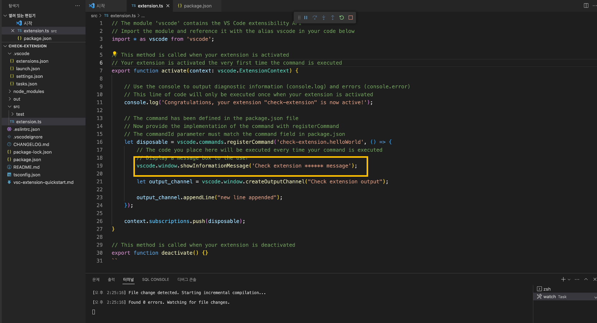
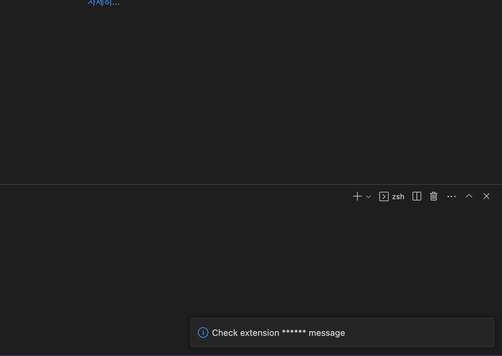

### vscode Extension

#### install nvm

[mac] 

```bash
curl -o- https://raw.githubusercontent.com/nvm-sh/nvm/v0.39.3/install.sh | bash
```

```
  % Total    % Received % Xferd  Average Speed   Time    Time     Time  Current
                                 Dload  Upload   Total   Spent    Left  Speed
100 15916  100 15916    0     0  39392      0 --:--:-- --:--:-- --:--:-- 41233
=> nvm is already installed in <$HOME>/.nvm, trying to update using git
=> => Compressing and cleaning up git repository

=> nvm source string already in <$HOME>/.zshrc
=> bash_completion source string already in <$HOME>/.zshrc
=> Close and reopen your terminal to start using nvm or run the following to use it now:

export NVM_DIR="$HOME/.nvm"
[ -s "$NVM_DIR/nvm.sh" ] && \. "$NVM_DIR/nvm.sh"  # This loads nvm
[ -s "$NVM_DIR/bash_completion" ] && \. "$NVM_DIR/bash_completion"  # This loads nvm bash_completion
```

#### Add source command

(~/.bashrc, ~/.zshrc, ~/.profile, ~/.bash_profile)

```
vim ~/.zshrc
```

```bash
export NVM_DIR="$HOME/.nvm"
[ -s "$NVM_DIR/nvm.sh" ] && \. "$NVM_DIR/nvm.sh"  # This loads nvm
[ -s "$NVM_DIR/bash_completion" ] && \. "$NVM_DIR/bash_completion"  # This loads nvm 
```

#### reopen console and run

```bash
nvm --version
> 0.39.3
nvm install 18.16.0
(nvm install node #latest ver)
nvm ls-remote  (#show available version)

>
v0.1.14
v0.1.15
v0.1.16
v0.1.17
v0.1.18
v0.1.19
v0.1.20
v0.1.21


#nvm use 18.16.0
#node -V
```

#### Install npm

if you're using 'nvm', 'npm' already has been installed.

```bash
which npm
> /Users/hyeri/.nvm/versions/node/v18.16.0/bin/npm
npm -v
> 9.5.1
```

#### Install yeoman

```bash
npm install -g yo 
```

```bash
yo code
```

```bash
     _-----_     ╭──────────────────────────╮
    |       |    │   Welcome to the Visual  │
    |--(o)--|    │   Studio Code Extension  │
   `---------´   │        generator!        │
    ( _´U`_ )    ╰──────────────────────────╯
    /___A___\   /
     |  ~  |     
   __'.___.'__   
 ´   `  |° ´ Y ` 

? What type of extension do you want to create? (Use arrow keys)
❯ New Extension (TypeScript) 
  New Extension (JavaScript) 
  New Color Theme 
  New Language Support 
  New Code Snippets 
  New Keymap 
  New Extension Pack 
  New Language Pack (Localization) 
  New Web Extension (TypeScript) 
  New Notebook Renderer (TypeScript)

? What's the name of your extension? Quickstart Extension(title)
? What's the identifier of your extension? quickstart-extension
? What's the description of your extension? It's an example(description)
? Initialize a git repository? n
? Bundle the source code with webpack? n
? Which package manager to use? (Use arrow keys)
❯ npm 
  yarn 
  pnpm 
```

- TS로 생성

#### Change the directory

Option 1. Reopen VSCode Window at `quickstart-extension`, which is a new `${workspaceFolder}`.

Option 2. Copy contents in `quickstart-extension` into `.`.

```bash
cp -rf ./quickstart-extension/* ./
rm -rf ./quickstart-extension
```

#### 예시화면

##### package.json



**command**는 실행할 커맨드 이름

**title**은 Command Palette에서 노출될 제목

##### extension.ts




```python
vscode.commands.registerCommand(command: str)
# command : bind the command identifier to title package.json command 
"""
package.json
"contributes": {
    "commands": [
      {
        "command": "check-extension.helloWorld",
        "title": "Check extension 11"
      }
    ]
  }

"""
```

vscode.commands.registerCommand(command:str)


#### build & Debug extension

 (press F5)

```bash
 File change detected. Starting incremental compilation...
 Found 0 errors. Watching for file changes.
```

새 창이 open, 

- **command + shift + p**

- 지정한 title 입력

- 아래와 같은 화면 확인

- 선택시 두번째 화면 (지정한 메세지 출력) > Check extesion **** message

- (vscode.window.showInformationMessage)



